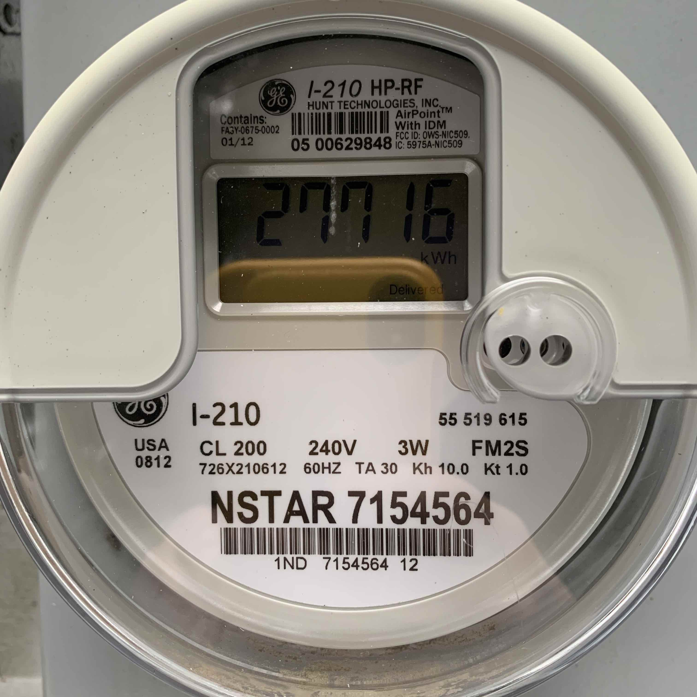
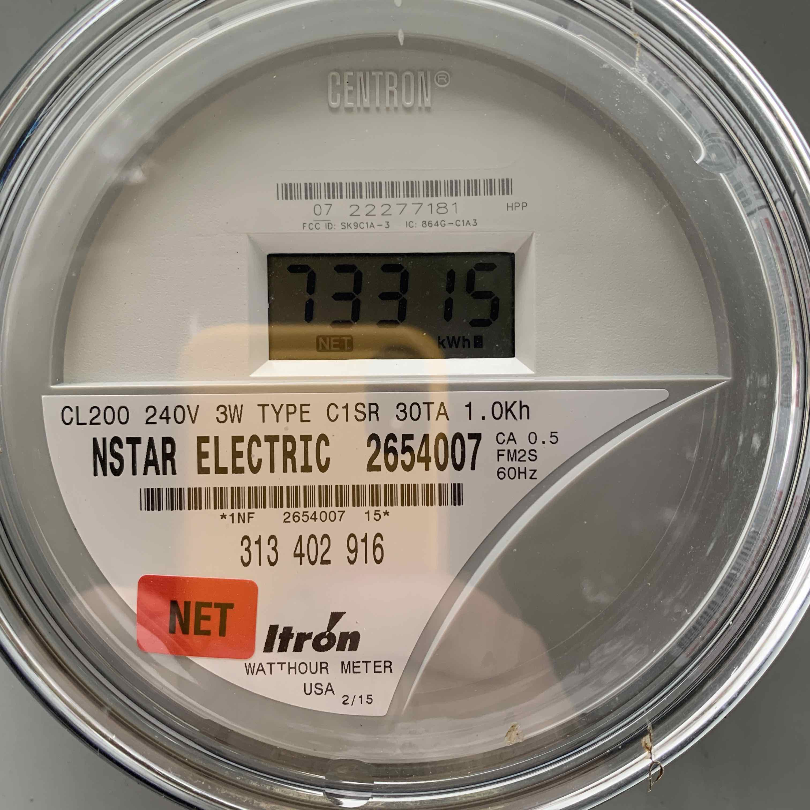
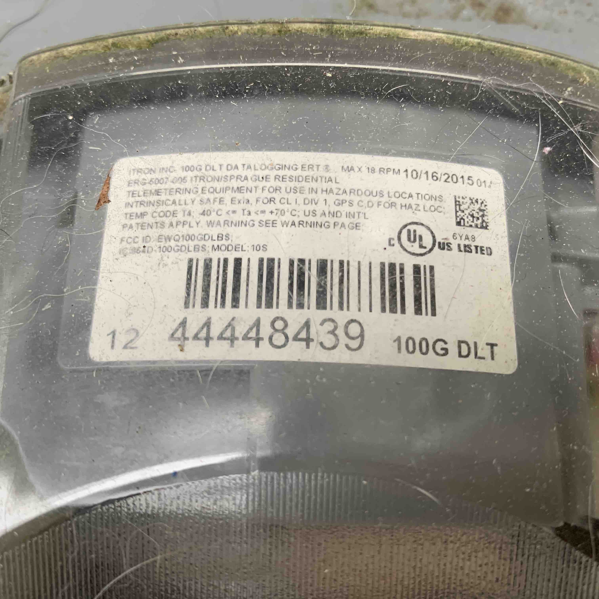
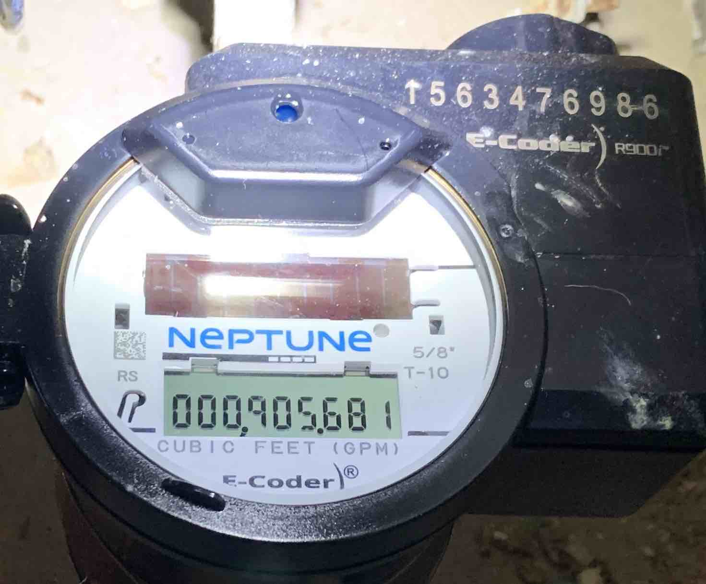

A sample variables.txt file is listed below.  It contains three types of data needed to read the meters:

* List of message types to let rtlamr what messages to decode
* List of meter IDs to let rtlamr know what meters to look for, to avoid clutter in the output
* Mapping of meter IDs to meter types.

It also contains network names/address to allow intra-container communication.  This also allows running containers on different computers.  

```bash
# will be exposed to python program as environment variables 

# comma-separated list of message types to receive in rtlamr: all, scm, scm+, idm, netidm, r900 and r900bcd
TYPES=scm,r900

# comma separated list of meter IDs to for rtlamr command line options
METER_IDS=629848,22277181,1563476986,44448439

# specific meters by type to setup correct sqlite tables
ELECTRIC_METER_IDS=629848,22277181
GAS_METER_IDS=44448439
WATER_METER_IDS=1563476986

# hostname/IP and port of the rtl_tcp server, defaults to container name/default port.
RTL_TCP_SERVER=rtl_tcp
RTL_TCP_SERVER_PORT=1234

# hostname/IP and port of the python server, defaults to container name/12345
PYTHON_SERVER=python
PYTHON_SERVER_PORT=12345
```

You can look at your meters to get the meter IDs.  Samples below.

## Generic SCM electric meter, type SCM, ID 629848:





## Netmeter electric meter, ID 22277181, type SCM, used with solar panels.



## Gas meter ID 44448430.



## Water meter ID 1563476986, type R900.




